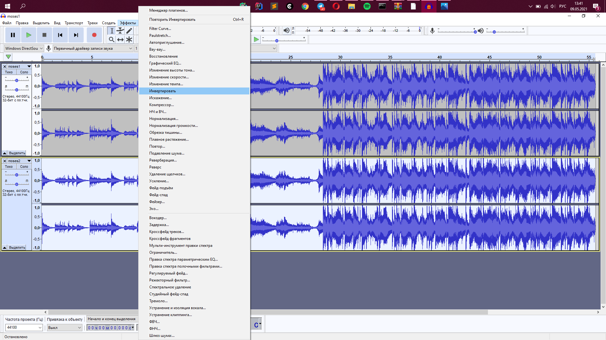
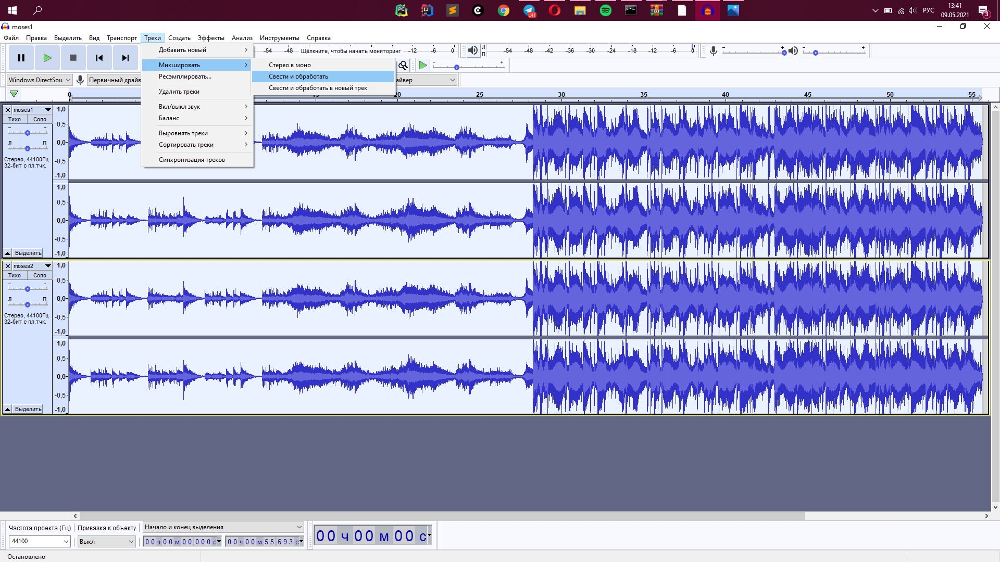
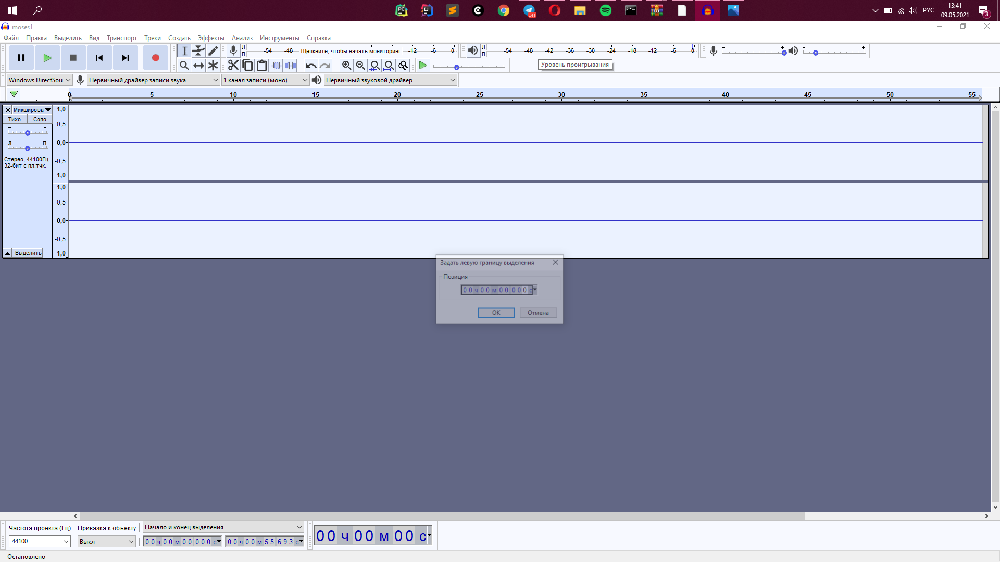
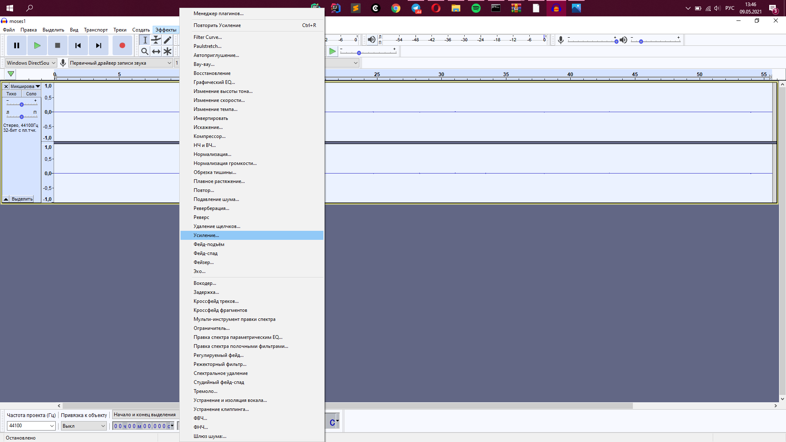
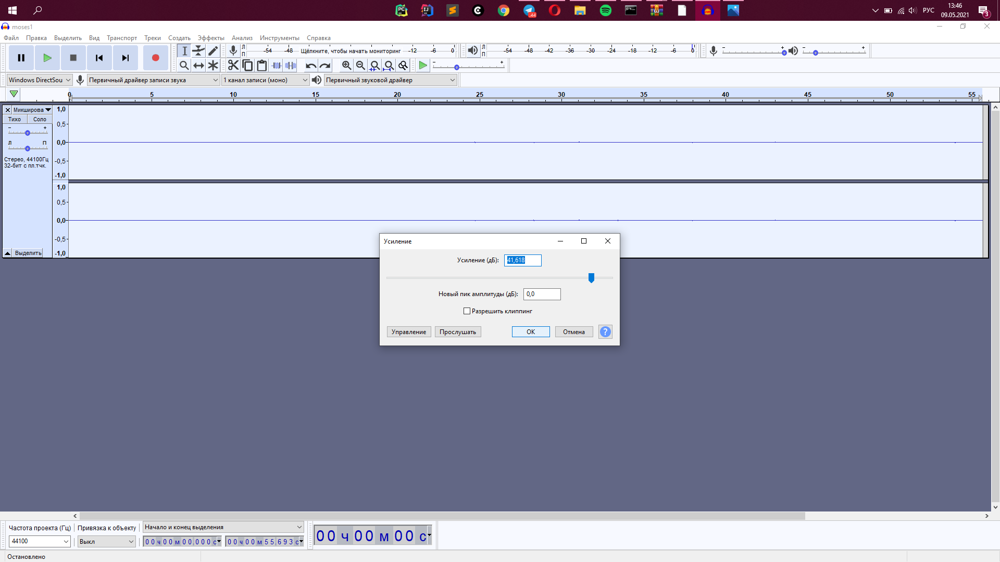
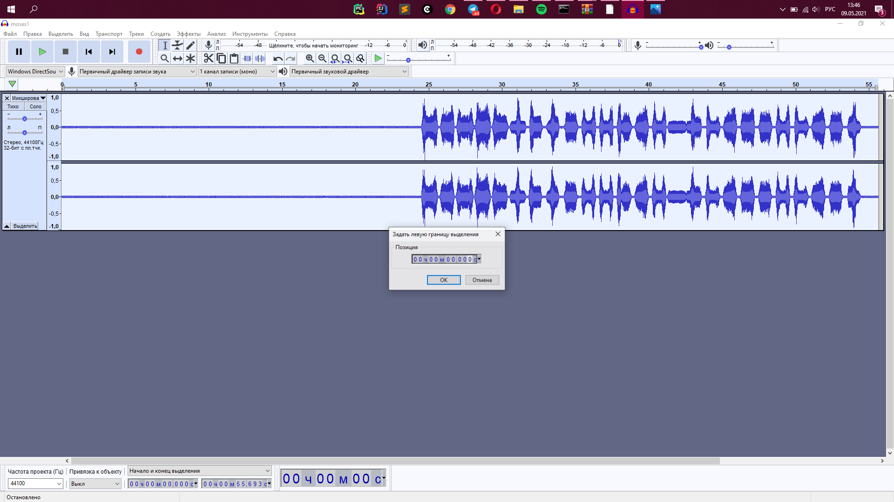
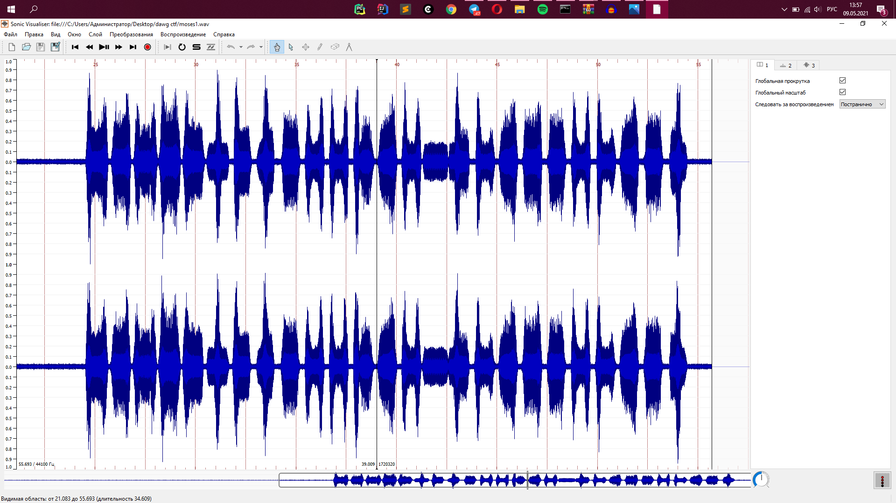
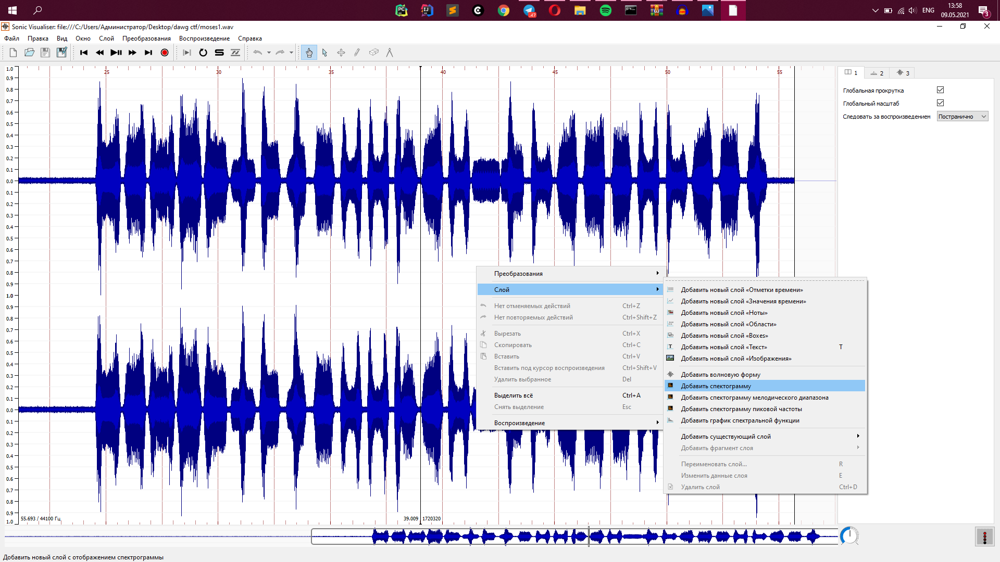
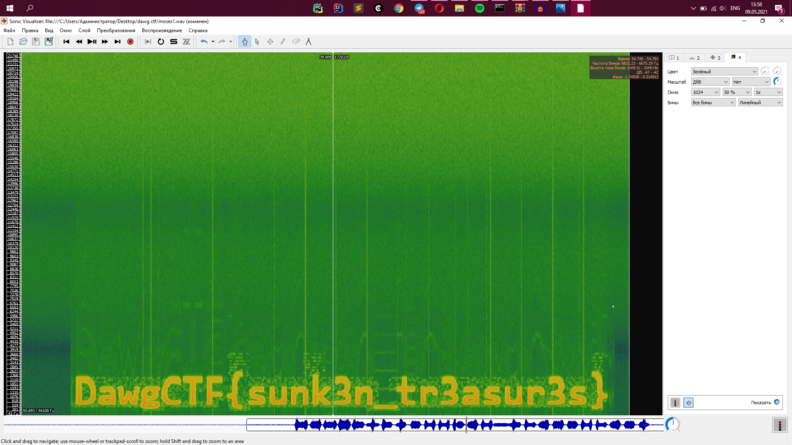

#DawgCTF
## Moses

Category | Points 
--- | --- 
Audio/Radio| 175 

- The link downloads an archive, there are 2 tracks in here:
  Both tracks sound the same, you can't hear the difference by ear, 
  but the size of the tracks is different, which suggests that there is still a difference in them.
- Load both tracks into `Audacity`

- From the description we see that it is required to separate the waves.
So I guessed that we should invert one of them and combine them into one track. 
Due to the addition of the wave and its inverted copy, the result is the same difference.
 
- Select the bottom track and invert it (Effects → Invert)

- Next, combine both tracks into one 
- Select both tracks → Tracks → Mix → Mix and Process

- So we got this

- It seems that there is some difference, but it is hard to see it. 
We use an amplifier to make the difference better visible. 
- Select track → Effects → Gain → Ok

- So we got this

- Do not turn on the recording, because the sound is unbearable. If the flag is not spoken in the audio recording, but we have arrived at something, then it is worth opening the spectrogram of the track.
  (I don't know if you can watch this in Audacity, but I usually use the Sonic Visualiser for these purposes)
  Export our track from Audacity 
- File → Export → Export as WAV

- Open up the Sonic Visualiser and drag our exported track there.

- We look at the spectrogram 
- RMB → Layer → Add Spectrogram

- So we have a flag on seafloor

Flag=DawgCTF{sunk3n_tr3asur3s}