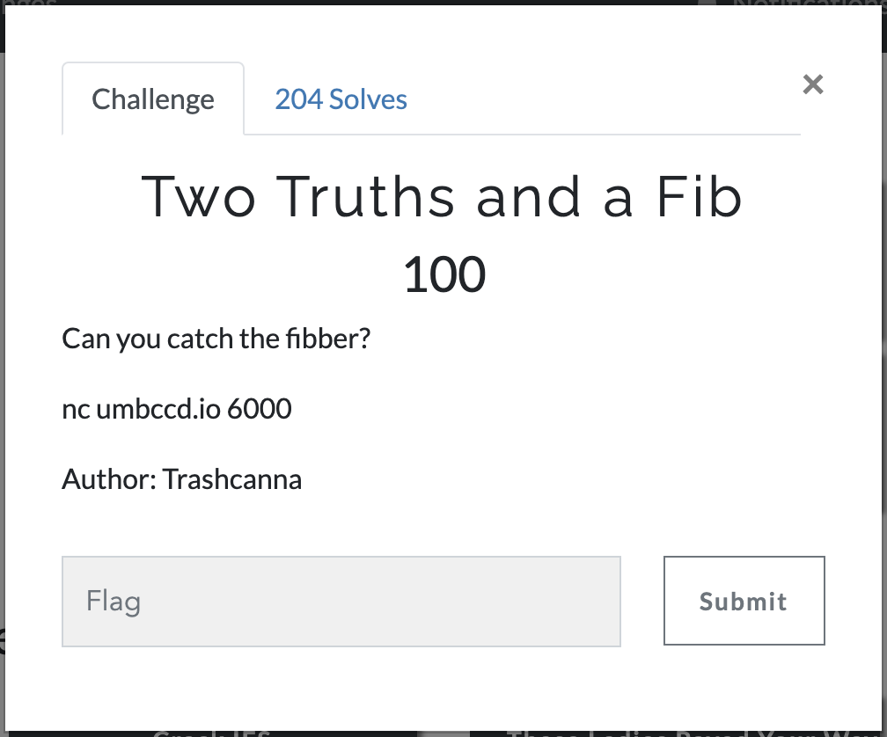
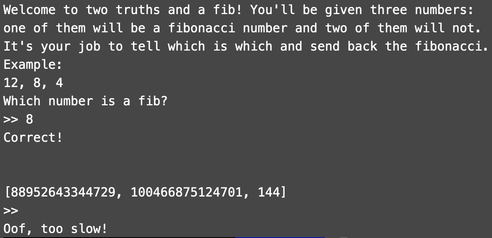

#DawgCTF
## TwoTruthsAndAFib

Category | Points 
--- | --- 
Misc| 100



- Go to the bash and type `nc umbccd.io 6000`



- We understood that we have to give quick answers to the server and define fibb number among all

- Ok, lets write an exploit on python using nclib

```
from nclib import netcat
import re


matrix = [[1, 1], [1, 0]]


def fib(n):
    a = 1
    ta = 0

    b = 1
    tb = 0

    c = 1
    rc = 0 
    tc = 0

    d = 0
    rd = 1
      
    while n:
        if n & 1:
            tc = rc
            rc = rc*a + rd*c
            rd = tc*b + rd*d

        ta = a
        tb = b
        tc = c

        a = a*a  + b*c
        b = ta*b + b*d
        c = c*ta + d*c  
        d = tc*tb + d*d
    
        n >>= 1
    
    return rc


def is_fib(n):
    i = 0
    while True:
        f = fib(i)
        if f == n:
            return True
        
        if f > n:
            return False
        
        i += 1


def main():
    conn = netcat.Netcat(('umbccd.io', 6000))
    data = conn.recv_until(b'Correct!\n\n\n')
    while True:
        data = conn.recv_line().decode().strip()
        print(data)

        nums = list(map(int, data[1:-1].split(', ')))
        
        ans = 0
        for num in nums:
            if is_fib(num):
                ans = num

        conn.send(f'{ans}\n')
        print(ans)
        print(conn.recv_line().decode())
        conn.recv_line()


if __name__ == '__main__':
    main()
```

- You can use another algorithm to find fibb number, fast exponentiation for example

- So, run the exploit and get the flag

flag=DawgCTF{jU$T_l1k3_w3lc0me_w33k}